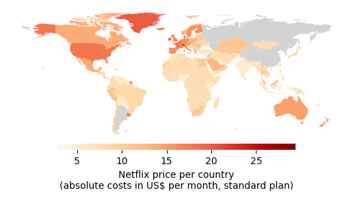
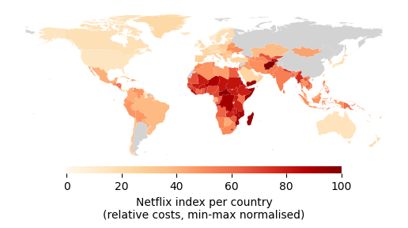

# Implicit price discrimination: the "Netflix index"

### About

This repo explores the (un)fairness in regional variations of Netflix prices. The main findings can be explored via this [interactive map](https://colinvn.github.io/netlix-index/).

**Background**: the prices for Netflix plans vary significantly by country. At first sight, however, prices seem to be lower in low-income countries and higher wealthier nations. Hence, prices could be unequal in absolute terms but account for regional purchasing power, thus being "fair" overall?

**Idea:** This project takes a closer look at the relative price levels, accounting for differences in economic wealth. It sets absolute prices in relation to a countries' Gross Domestic Product (GDP) per capita. From this comparison, a "Netflix index" is created, with low values indicating a low *relative* price for streaming Netflix in a given country. As we will see, this partly flips the original (absolute) findings upside down.

The project sheds light on the practice of implicit price discrimination, particularly of the third degree. Here, firms segment the market (in the case of Netflix: along countries) and charge different prices in different segments.[^1]

The repo is a self-sustained data science project using Python/Jupyter notebooks with a focus on geospatial analysis. 

### Main findings

<table width="100%">
	<tr>
		<th width="50%">Netflix price (absolute costs)</th>
		<th width="50%">Netflix index (relative costs)</th>
	</tr>
	<tr>
		<td>
			monthly costs for Netflix standard plan in that country, converted to US$
		</td>
		<td>
			monthly costs for Netflix standard plans in relation to national GDP per capita,
			log-transformed and min-max normalised (details see below)
		</td>
	</tr>
	<tr>
		<td>
			
		</td>
		<td>
			
		</td>
	</tr>
	<tr>
		<td>
			<strong>Observation:</strong> Countries in the Global North/with stronger economies
			pay more for their Netflix subscriptions. Sounds about right?
		</td>
		<td>
			<strong>Observation:</strong> The price differences in the left map fail to even out
			the difference in purchasing power. If we account for standards of living (via GDP per capita),
			the relative costs in the Global South are in fact much higher.
		</td>
	</tr>
</table>

Pre [here](https://www.voronoiapp.com/entertainment/Netflix-subscription-cost-around-the-world-403).

### Methodology

#### Data acquisition (web scraping & APIs)

For each country $i \in I$, retrieve:
- price of a Netflix subscription $p_i$ and its currency of denomination $c_i$ (source: Netflix website)
- exchange rate between $c_i$ and US \$: $s_{c_i / \$}$ (source: European Central Bank & XE.com)
- gross domestic product (GDP) $Y$ per capita (PCAP) $N$ in  US \$: $y_i = \frac{Y_i}{N_i}$ (source: World Bank). While *total* GDP is a proxy to measure a country's economic output, the GDP *per capita* is a proxy for the country's standard of living.

#### Data preparation

For each country $i$, compute:
- price of a Netflix subscription in  US \$: $p_{i,\$} = \frac{p_i}{s_{c_i / \$}}$ 
- **relative Netlix price** as the ratio of the local price in  US \$ to the local GDP PCAP: $p_{i,\text{rel}} = \frac{p_{i,\$}}{y_i} $

#### Data analysis

For a cross-country analysis,

- to account for the positive skewness of the data (i.e. long tail towards high values / towards the right), compute log prices $l_i = \ln (p_{i,\text{rel}} +1)$, where the summand $+1$ ensures positivity of all log prices 
- to make values comparable, scale all log-prices to the range from 0 to 100:
	- identify upper and lower bound on the set of all log prices: $l_{\max}= \max_{i\in I} l_i$ and $l_{\min}= \min_{i\in I} l_i$
	- apply the scaling: $n_i = \frac{l_i-l_{\min}}{l_{\max}-l_{\min}}*100 \in {[0,100]}$

The final value $n_i$ can be interpreted as a country's **Netflix index**: it indicates how expensive a Netflix subscription in this country is in comparison to its GDP and in comparison to other countries. Low values (close to $0$) mean it is relatively cheap to subscribe given this standard of living (proxied by GDP per capita), while high values (close to $100$) can be interpreted as high subscription cots considering the local standards.

#### Data visualisation

We use `matplotlib`'s `pyplot` for simple static maps and `folium` for interactive plots.

### Usage

The analysis can be reproduced by running the Jupyter notebook:

```
pyenv local 3.12.12
python -m venv .venv
source .venv/bin/activate
pip install --upgrade pip
pip install -r requirements.txt
```

The data acquired through web scraping and APIs is contained in the `data` directory to make the findings reproducible should the original sources no longer be available.

---

[^1]: Note that Netflix plans may vary across countries not just in terms of price. For example, the number of shows available may differ, partly justifying price differences. Similary, since we compare net prices, differences may be due to different taxation levels.
